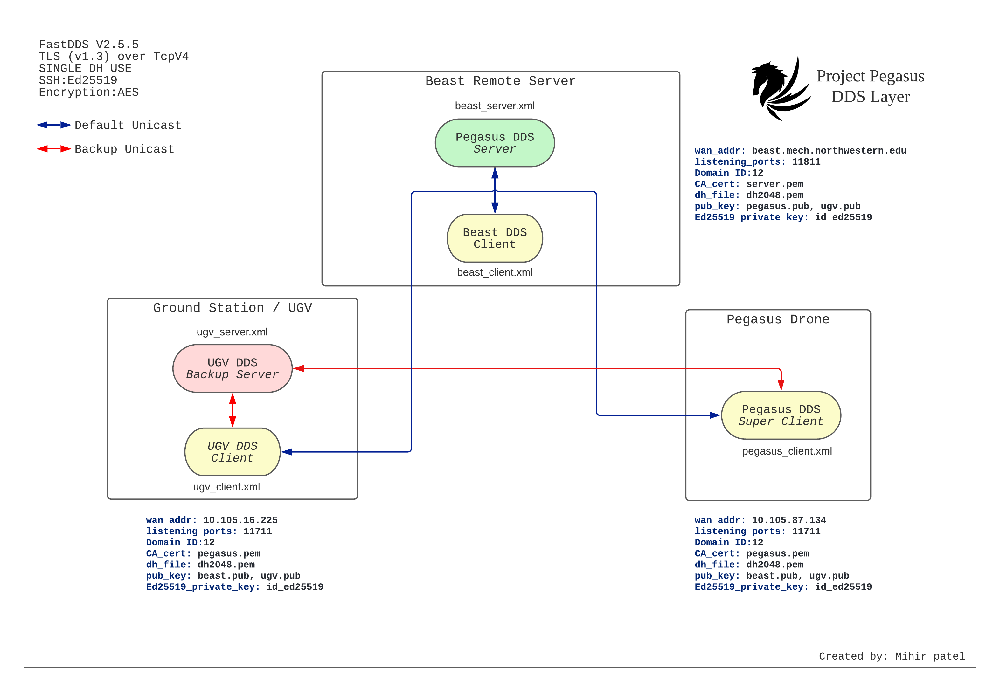

## Pegasus DDS Layer



<Button type="secondary" href="https://github.com/PegasusDrone/docs/raw/main/src/content/DDS/Pegasus_DDS.pdf">Download Robokinesis.SchDoc</Button>

- ~/.zshrc configuration

```
---
highlight: [7,18]
---
ros2s(){
     export ROS_DOMAIN_ID=12
     export ROS_VERSION=2
     export ROS_PYTHON_VERSION=3
     export RMW_IMPLEMENTATION=rmw_fastrtps_cpp
     export FASTRTPSGEN_DIR=$HOME/.local/bin/
     export FASTRTPS_DEFAULT_PROFILES_FILE={path_to_pegasus_dir}pegasus/pegasus_dds/BEAST_FASTRTPS_CLIENT.xml
     export RMW_FASTRTPS_USE_QOS_FROM_XML=1
     export ROS_DISTRO=galactic
     export LD_LIBRARY_PATH=$HOME/ros2/galactic/lib:$LD_LIBRARY_PATH
     source $HOME/ros2/galactic/setup.zsh
     # export ROS_DISCOVERY_SERVER=129.105.69.168:12298
}

ros2d(){
     export ROS_DOMAIN_ID=12
     export RMW_IMPLEMENTATION=rmw_fastrtps_cpp
     export FASTRTPS_DEFAULT_PROFILES_FILE={path_to_pegasus_dir}pegasus/pegasus_dds/BEAST_FASTRTPS_CLIENT.xml
     export RMW_FASTRTPS_USE_QOS_FROM_XML=1
     export ROS_DISTRO=galactic
     source $HOME/mihir/ros2/galactic/setup.zsh
     ros2 daemon stop
     ros2 daemon start
}

ros1s(){
     export ROS_VERSION=1
     export ROS_PYTHON_VERSION=3
     export ROS_DISTRO=noetic
     export LD_LIBRARY_PATH=$HOME/ros1/noetic/lib:$LD_LIBRARY_PATH
     export PYTHONPATH=$HOME/ros1/noetic/lib/python2.7/dist-packages:$HOME/ros1/noetic/lib/python3/dist>
     export ROS_PACKAGE_PATH=$HOME/ros1/noetic/share
     export PKG_CONFIG_PATH=$HOME/ros1/noetic/lib/pkgconfig
     export ROS_ROOT=$HOME/ros1/noetic/share/ros
     source $HOME/ros1/noetic/setup.zsh
     source $HOME/ros_ws/rosbridge_suite/devel/setup.zsh
}

```

> Author: [Mihir Patel](https://github.com/mihyr)