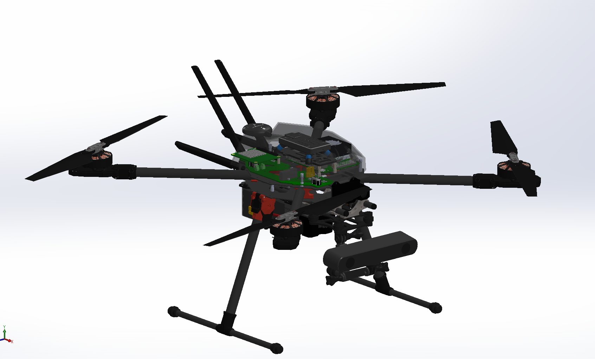
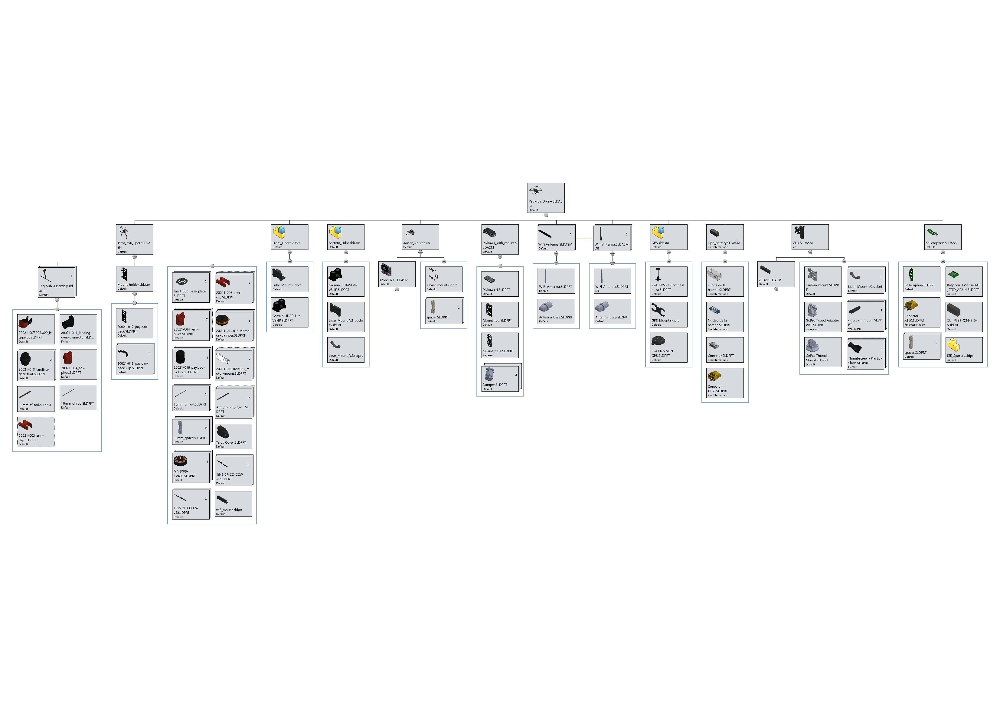

# Pegasus Design

Virtual CAD model for pegasus was made in Solidworks 2019 Edu.

<Button type="secondary" href="https://github.com/PegasusDrone/hardware">View CAD on Github</Button>

## Heirarchy

<Button type="secondary" href="heirarchy.pdf">View Heirarchy.pdf</Button>

## 3D Prints

<ButtonGroup>
  <Button type="primary" href="https://www.thingiverse.com/mihirpatel/designs">View my STLs on Thingiverse</Button>
  <Button type="secondary" href="https://github.com/PegasusDrone/hardware/tree/main/stl">View on Github</Button>
</ButtonGroup>