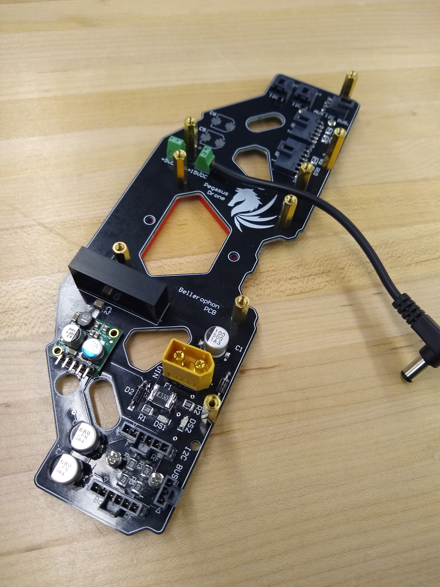

# Pegasus Drone

Pegasus is a px4 based enterprise grade 4G drone build from the ground up. Equipped with an onboard Xavier Nx system, a Zed stereo Camera, redundant lidars (range finders), Pegasus is a ROS2 based drone capable of flying autonomously and mapping the environment.
The LTE module allows live streaming of the drone data to a remote server for large scale spatial mapping performed in real time.

A FastDDS based AES encripted pipeline was setup to stream the data to the server. Apart from remote DDS streaming, the drone uses FastDDS for sending uORB messages to the pixhawk flight controller.

<Aside type="warning" header="Pages To-Do">

- CAD Files and 3D printed parts Page
- Schematic Files Page
- Steps to setup Xavier NX
- Steps for RPi cross Compilation
- Steps to setup TS16s Transmitter
- Steps to update X8R Receiver Firmware
- References (Links)

</Aside>
