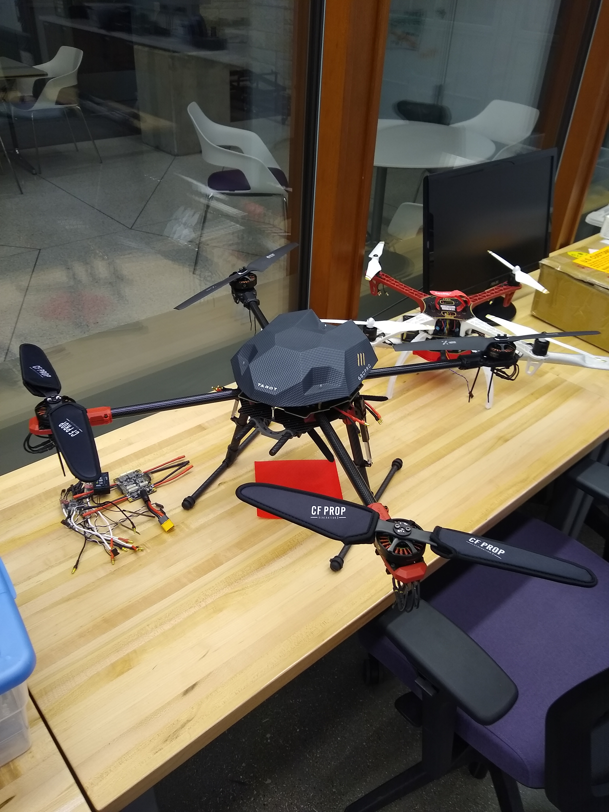

# Pegasus Drone

## Overview

Pegasus is a px4 based enterprise grade 4G drone build from the ground up. Equipped with an onboard Xavier Nx system, a Zed stereo Camera, redundant lidars (range finders), Pegasus is a ROS2 based drone capable of flying autonomously and creating 3D stereo-based maps of the environment.
The LTE module allows live streaming of the drone's stereo data to a remote server for large scale spatial mapping performed in real time.

A FastDDS based AES encripted pipeline was setup to stream the data to the server. Apart from remote DDS streaming, the onboard xavier system also uses FastDDS for sending uORB messages to the pixhawk flight controller (an alternative to mavlink).

## What sets Pegasus apart?

The hardware stack is open, configurable and costs about one third compared to enterprise grade drones with similar features like DJI Matrice 300RTK. Any hardware damage can be easily replaced at minimal cost.
This makes it best suited for research, especially in Aerial robotics, where flight crash while developing autonomy software stacks are frequent.

## Site Navigation

- [Hardware](https://pegasus.mihr.io/Hardware)
  - [CAD Design](https://pegasus.mihr.io/Hardware/design)
  - [Hardware components BOM and selection](https://pegasus.mihr.io/Hardware/BOM)
  - [Sensor & actuators selection](https://pegasus.mihr.io/Hardware/selection)
  - [TX16s transmitter specifics](https://pegasus.mihr.io/Hardware/controller)
- [Electronics](https://pegasus.mihr.io/Electronics)
  - [Drone Schematic](https://pegasus.mihr.io/Electronics/schematic)
  - [Custom PCB schematic](https://pegasus.mihr.io/Electronics/pcb)
  - [Altium PCB layout](https://pegasus.mihr.io/Electronics/download)
- [DDS](https://pegasus.mihr.io/DDS/dds)
  - [DDS setup](https://pegasus.mihr.io/DDS/dds)
- [Stereo](https://pegasus.mihr.io/Stereo)
  - [Visual Inertial Odometry](https://pegasus.mihr.io/Stereo/vio)
  - [Visual Slam / Spatial Mapping](https://pegasus.mihr.io/Stereo/mapping)
- [Instructions](https://pegasus.mihr.io/Instructions)
  - [Steps for RPi Cross compilation](https://pegasus.mihr.io/Instructions/rpi)
  - [Steps to setup Xavier Nx on the drone](https://pegasus.mihr.io/Instructions/xavier)
  - [Px4 DDS setup](https://pegasus.mihr.io/Instructions/px4)
  - [Flight Routine setup (offboard mode)](https://pegasus.mihr.io/Instructions/routine)
  - [Pre-Flight Checklist](https://pegasus.mihr.io/Instructions/checklist)
- [Medusa Drone](https://pegasus.mihr.io/Medusa)
  - [Hardware](https://pegasus.mihr.io/Medusa/BOM)
  - [Schematic / Wiring](https://pegasus.mihr.io/Medusa/schematic)
  - [CAD](https://pegasus.mihr.io/Medusa/cad)

---

---

<Aside type="warning" header="Pages To-Do">

- CAD Files and 3D printed parts Page
- Schematic Files Page
- Steps to setup Xavier NX
- Steps for RPi cross Compilation
- Steps to setup TS16s Transmitter
- Steps to update X8R Receiver Firmware
- References (Links)

</Aside>
